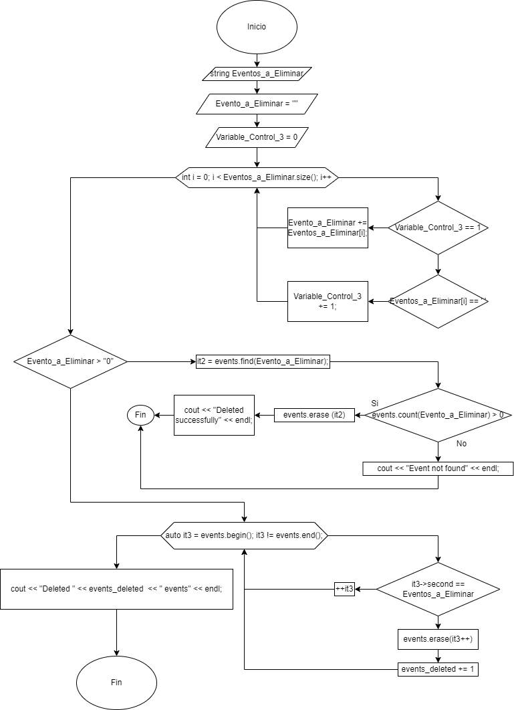
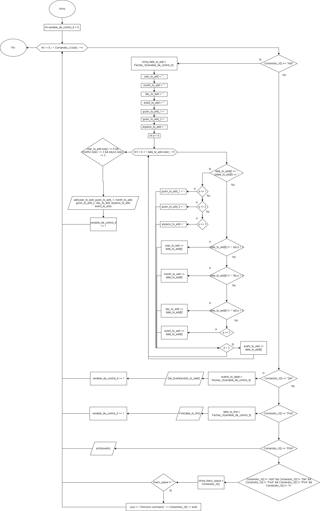
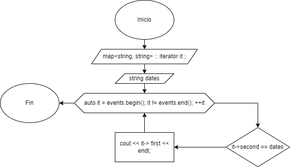
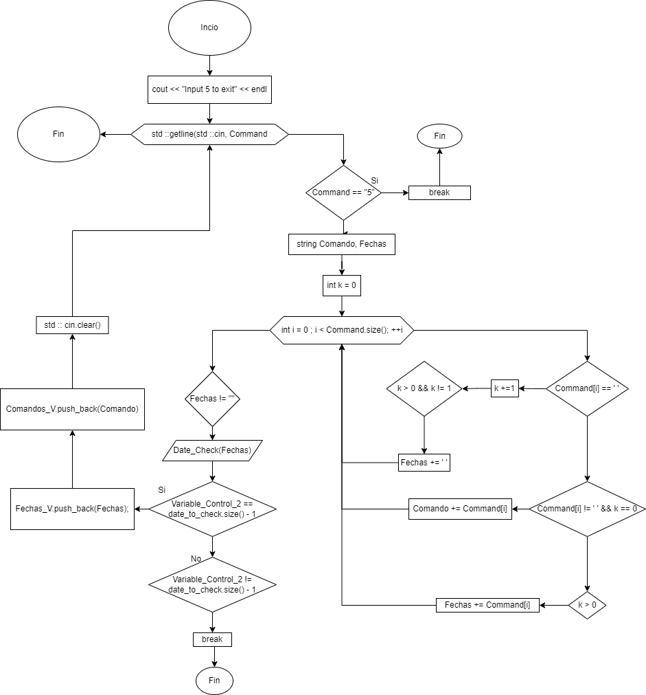
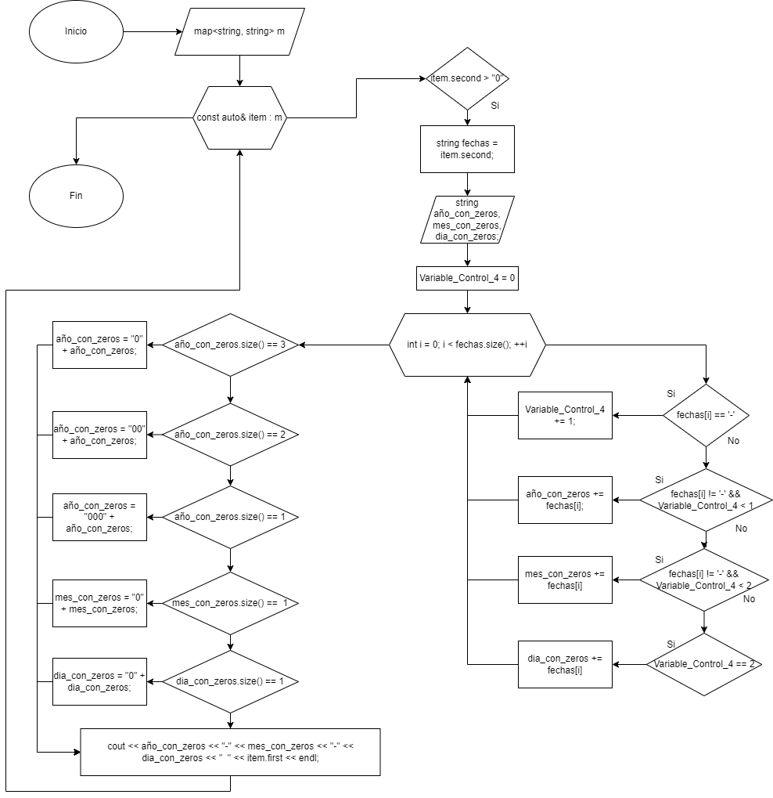

# Examen-Final-Progra
Materia: Introduccion a la Programacion       Fecha: 17/06/24
Estudiante: Andres Matias Mallea Acebey
## El Problema:
El problema a propuesto a desarrollar consiste en la elaboración de una "base de datos simple " la cual funcione en base una comunicación con el usuario por medio de comandos. Esta "base de datos" almacena datos de fechas acompañadas con el nombre de un evento.
Siendo que dentro del problema se pide dentro del desarrolló que el Programa debe dar la opción de uso de "5" funciones 
Las cuales deben de concistir de:
● Una función para añadir eventos a la base de datos.
● Una función para eliminar uno o más eventos anclados a  una fecha
●Una función la cual al introducir una fecha especifica muestre todos los eventos anclados a esa fecha
●Una función la cual muestre todas las fechas junto a sus eventos respectivos de manera ordenada

Una vez sabiendo en que consiste el problema nos toca preguntarnos que tipo de base de datos se planea desarrollar y para eso necesitamos saber ¿Que es una base de datos y sus tipos ?
## ¿Que es una base de datos?
Una base de datos es un tipo de aplicación o programa centrado en la recolección de información y su almacenamiento, siendo la base de muchos programas y aplicaciones.
Habiendo varios tipos de bases de datos tales como:
●Base de datos relacional:
Estas son Bases de datos basadas en la creación y uso de diferentes contenedores de información los cuales se denomian tablas  en las cuales se almacenan la información En forma de un registro siiendo que las distingue qué los datos encontrados en estas tienden a tener relaciones es entre si por medio de índices y otros indicadores.
●Base de datos distribuida 
Estas son Bases de datos las cuales no tienen su información almacenada en un solo "servidor" si no en varios.
●Bade de datos orientada a objetos 
Estas son Bases de datos basadas en el almacenamiento de objetos los cuales se denominan como un conjunto heretogeneo de datos.
●Bases de datos NoSQL
Estas son Bases de datos las cuales no usan tablas sino colecciones de elementos. Siendo que los elementos almacenados en los mismo son heterogeneos Siendo que no tienen que tener una relación entre si. Además que se caracteriza por el no utilizar SQL.

Sabiendo ya lo anterior  podemos determinar que la base de datos a desarrollar será una base de datos NoSQL al nuestra base de datos concistir de dos colecciones de elementos los cuales no parecen tener una relación clara. Siendo ejemplos de bases de datos NoSQL, MongoDB o CouchDB.
Siendo a si teniendo ya una idea de lo que se va a desarrollar debemos saber el porqué estamos haciendo esta "base de datos"
Así el desarrollo de esta "base de datos" se basa en el echo que estas son la base de mucha otras aplicaciones más complejas y su entendimiento y capacidad de desarrollarlos es esencial para nuestro desarrollo como ingenieros de Software
## Estructura del repositorio:
El repositorio en el cual se encuentra la solución del problema esta compuesto por tres archivos cpp:
El archivo Examen_F:
Donde se encuentra el código y desarrollo de las funciones dadas por el problema para la ejecución del mismo.
El archivo Funcion_De_Chequeo:
En la cual se encuentra el cuerpo de la función la cual chequea el formato de entrada de los inputs del usuario.
El archivo man:
Donde se encuentra el man y de donde se ejecuta el código 
Además de esos anchos cpp esta un archivo .h llamado Examen_F.h en donde se encuentran las variables, vectores, maps y demás componentes para el funcionamiento del programa
Descripción de funciones 
Este programa se compone de 7 funciones principales las cuales serían 

● Data_Check:
Esta función lo que hace es en base a un string el cual es introducido por el usuario revisa si este cumple con 2l formato de entrada dado para la entrada de la fecha.
●add:
Esta función lo que hace es es guardar los distintos string qué el usuario a introducido por medio de la terminal en el caso de que cumplan con las condiciones del formato de entrada
●print:
Esta función lo que hace es mostrar al usuario de una manera ordenada los distintos datos guardados por la función "add" de una manera ordenada.
●Find:
Esta función lo que hace es el mostrar el o diversos eventos almacenados dentro del programa de una fecha especifica.
●Del_Event: 
Esta función lo que hace es el borrar uno o varios de los eventos almacenados dentro del programa.
●Ejecution_De_Comandos: 
Esta función lo que hace es la ejecución de los diversos comandos dados por el usuario.
●BD:
Esta función es la encargada de la comunicación con el usuario por medio del flujo estándar en un loop "infinito" para escribir los distintos comandos a ejecutar
## Diagramas
### Del_Event
Esta funcion lo que hace es en base a el stri g inicial lo separa entre la fecha y el evento. Una vez separados ve si se introdujo o no un evento especifico. En caso de no tener un evento este pasa a borrar a todos los eventos ligados con la fecha indicada.

### Ejecution_De_Comandos

### Find

### Data_Check

### BD

### add

### print

## Herramientas Utilizadas
Estas fueron
Visual Code Studio
Google
Git hub
Git bash
Programiz
